# Установка гипервизора и создание виртуальных машин
1. [Настройка гипервизора](#Настройка-гипервизора)
2. [Установка виртуальной машины](#Установка-виртуальной-машины)
	1. [Создание новой ВМ](#Создание-новой-ВМ)
	2. [Установка ОС на ВМ](#Установка-ОС-на-ВМ)
		1. [Установка Rocky Linux в графическом режиме](#Установка-Rocky-Linux-в-графическом-режиме)
3. [Организация удалённого доступа к ВМ](#Организация-удалённого-доступа-к-ВМ)
	1. [Первоначальная подготовка](#Первоначальная-подготовка)
	2. [Первый способ генерации и копирования SSH ключей](#Первый-способ-генерации-и-копирования-SSH-ключей)
		1. [Первый метод копирования SSH ключей](#Первый-метод-копирования-SSH-ключей)
		2. [Второй метод копирования SSH ключей](#Второй-метод-копирования-SSH-ключей)
		3. [Третий метод копирования SSH ключей](#Третий-метод-копирования-SSH-ключей)
	3. [Второй способ генерации и копирования SSH ключей](#Второй-способ-генерации-и-копирования-SSH-ключей)

---

##### Цель работы:
>Получить навыки по работе с гипервизором, развертыванию виртуальной инфраструктуры, удаленному подключению к ВМ и настройке SSH ключей.

---

## Настройка гипервизора
>[!NOTE]
>Виртуальные машины широко применяются в среде разработки ПО для тестирования нового функционала без ущерба для производственного контура. Для создания новых и управления имеющимися ВМ используется программа, называемая гипервизором. Она позволяет выделить ресурсы компьютера-хоста и отдать их в распоряжение операционной системы виртуальной машины. На рынке представлено несколько продуктов от разных производителей, в данной работе выбор был сделан в пользу гипервизора Workstation компании VMware.

После установки гипервизора (данный этап был описан здесь: [подготовка к лабораторным работам](Preparation_for_labs.md)) на вашем ПК будут доступны следующие программы:

- Command Prompt for vctl – утилита командной строки VMware для управления контейнерами (нам она не пригодится);
- Virtual Network Editor – средство настройки виртуальных сетей;
- VMware Workstation 17 Player – программа для запуска ВМ;
- VMware Workstation Pro – гипервизор.


Перед началом работы непосредственно с гипервизором проверим настройки виртуальных сетей. Для этого откроем Virtual Network Editor с *правами администратора*, так как она вносит изменения в конфигурацию сетевых адаптеров хоста (вашего ПК).

После открытия в верхней части окна можно увидеть таблицу с настроенными виртуальными сетями, а в нижней конфигурацию выбранной сети. По умолчанию преднастроено три сети разного типа:

- VMnet0 – сеть типа **мост** (bridged). Данный тип сетевого подключения создает прозрачный мост между интерфейсом ВМ и сетевым интерфейсом хоста. В его настройках лучше задать выбор интерфейса хоста статично, особенно в том случае, если на компьютере или ноутбуке несколько таких интерфейсов. Виртуальные машины, подключенные мостом, будут воспринимать сеть хоста так, будто они сами непосредственно подключены к ней.


- VMnet1 – сетевое подключение типа **внутренняя сеть** (host-only). Такая сеть объединяет подключенные в нее ВМ, но не предназначена для выхода в интернет. В настройках можно создать виртуальный сетевой адаптер для хоста в этой сети, таким образом организовав сетевую связность хоста и виртуальных машин в этой сети. Также можно настроить протокол DHCP для автоматического конфигурирования сетевых интерфейсов виртуальных машин.


- VMnet8 – сеть типа **NAT** (Network Address Translation). Данная сеть предназначена для доступа ВМ к глобальной сети, однако в случае отправки запроса во внешний мир производится подмена IP-адреса источника на IP-адрес активного интерфейса хоста. Внутри же сети узлы обмениваются информацией, используя недоступные глобально IP-адреса. Теперь в рамках настроек DHCP имеется возможность не только управлять стандартными параметрами выдачи IP-адресов, масок подсетей и шлюзов, но и настраивать правила NAT.


Давайте проверим присутствие соответствующих сетевых интерфейсов на хосте. В случае Windows проверить это можно открыв PowerShell (оболочка командной строки Windows) и введя команду:

```bash
Get-NetIPAddress -AddressFamily IPv4 -InterfaceAlias "VMware*" | Format-Table -Property InterfaceAlias, IPAddress
```


Как видно на скрине выше, в системе присутствуют два виртуальных интерфейса из рассмотренных ранее сетей VMnet1 и VMnet8. Причем IP-адреса соответствуют диапазонам указанным в настройках виртуальных сетей.

В данной работе необходимо обеспечить доступ ВМ в глобальную сеть, используя сетевые интерфейсы NAT или bridge.

---

## Установка виртуальной машины
### Создание новой ВМ


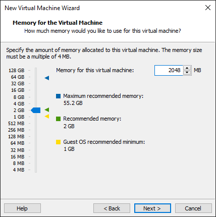


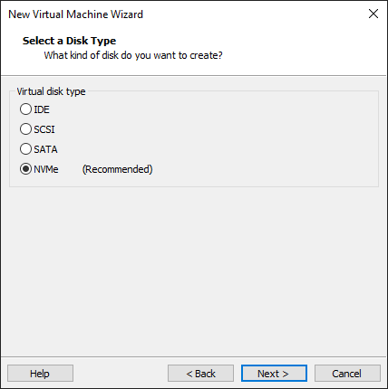


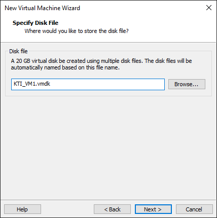


### Установка ОС на ВМ


### Установка Rocky Linux в графическом режиме


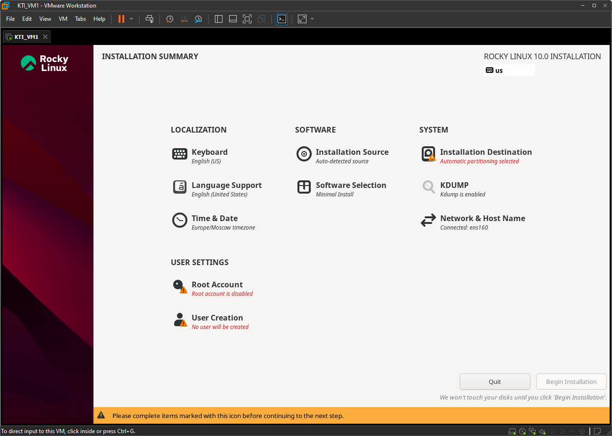


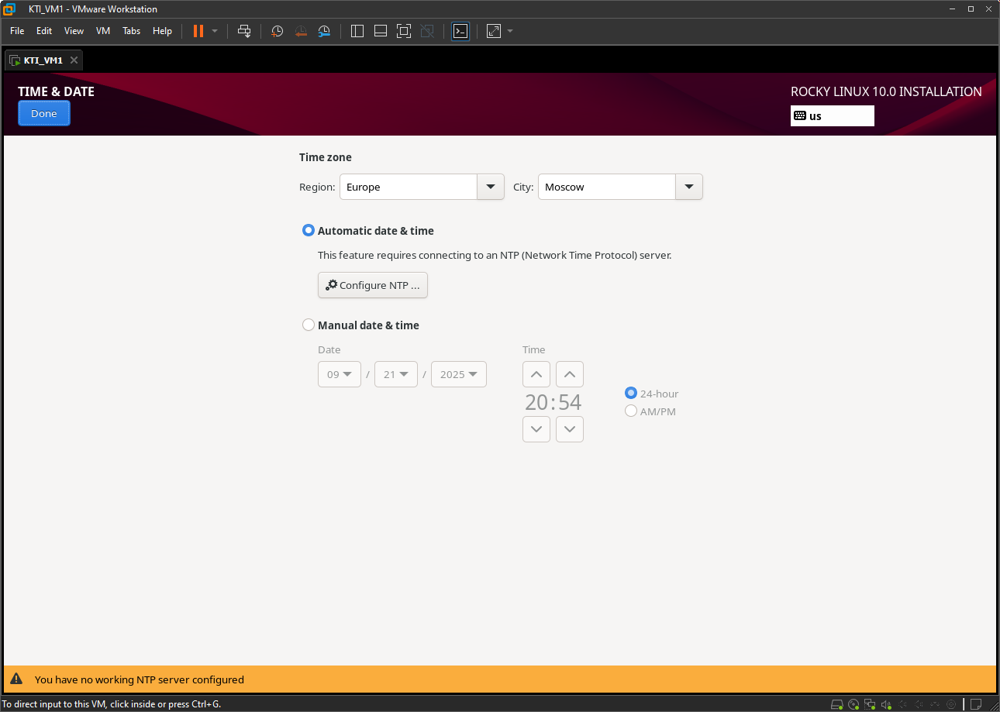


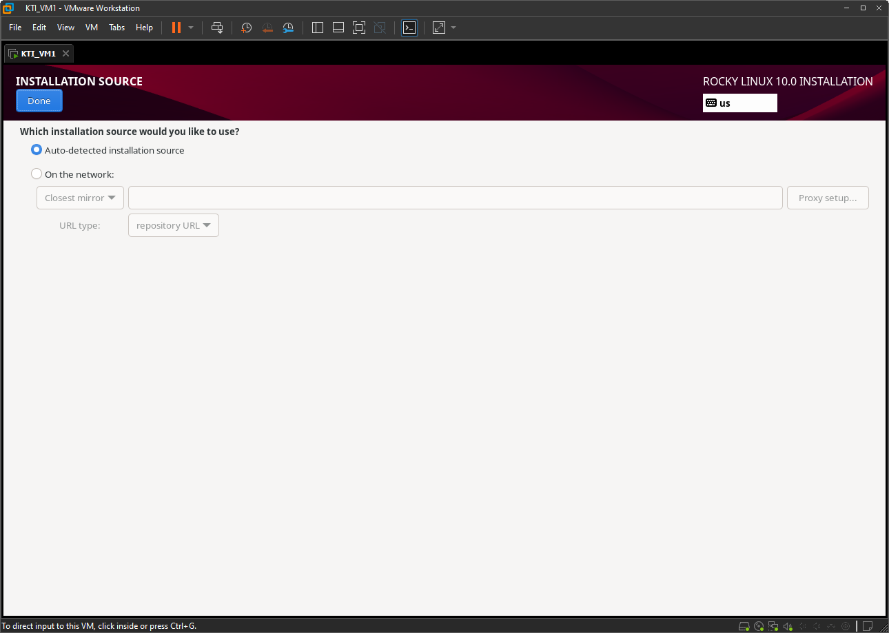


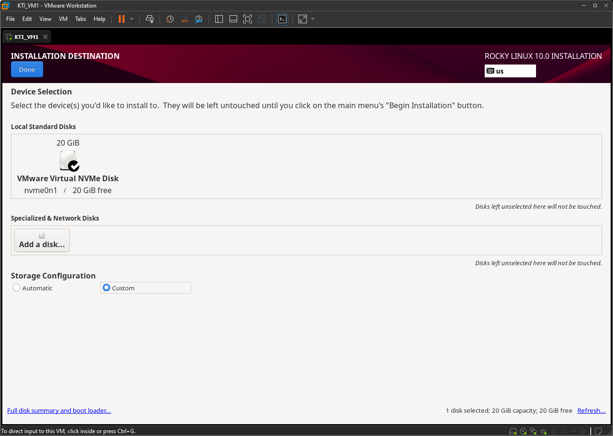

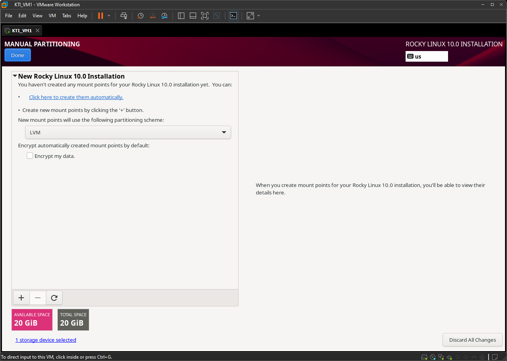


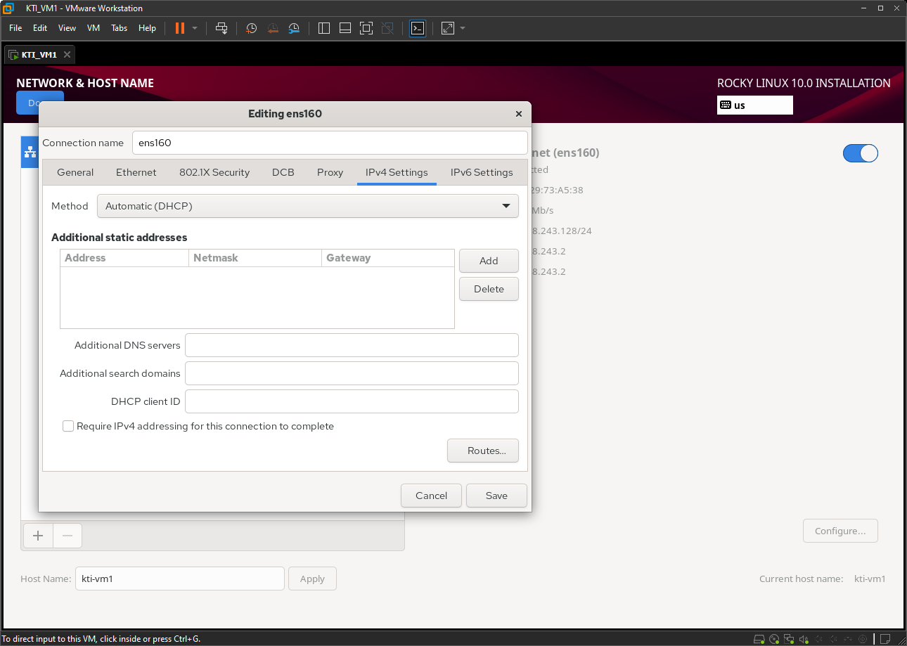

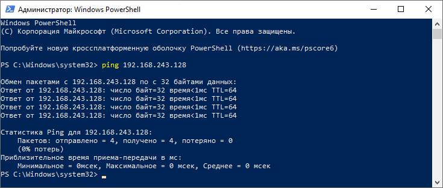


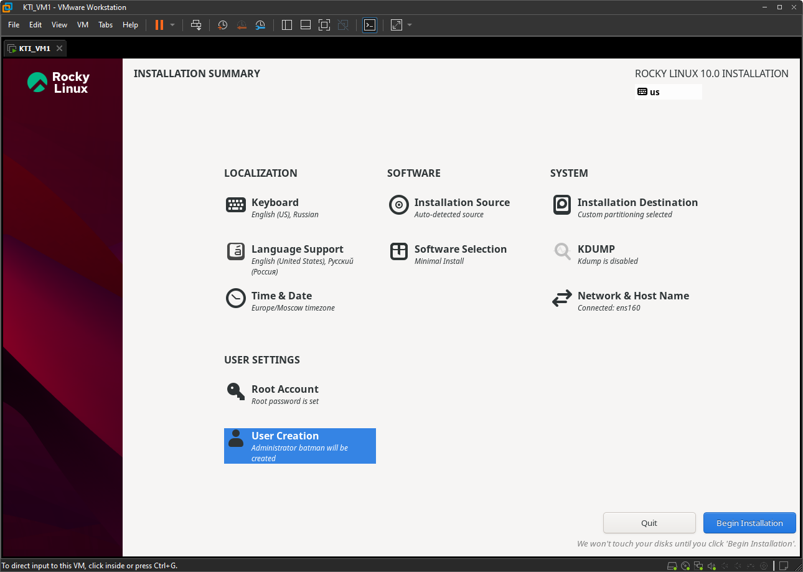

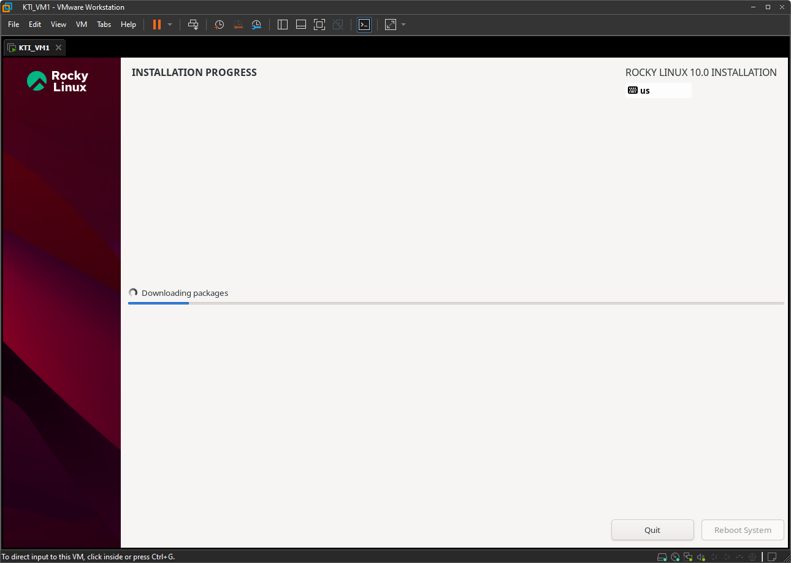


---

## Организация удалённого доступа к ВМ
### Первоначальная подготовка


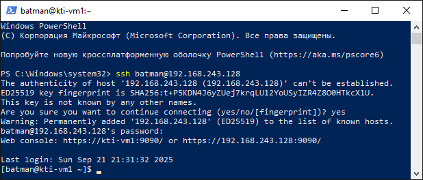


### Первый способ генерации и копирования SSH ключей

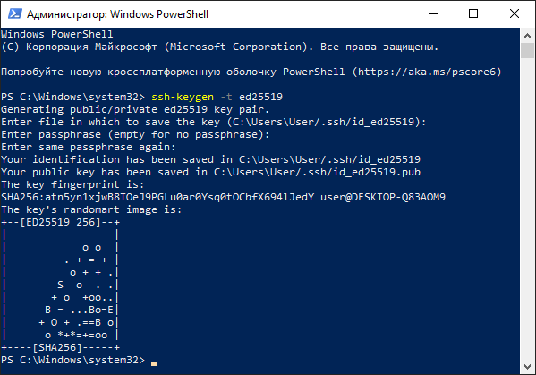


#### Первый метод копирования SSH ключей


#### Второй метод копирования SSH ключей


#### Третий метод копирования SSH ключей

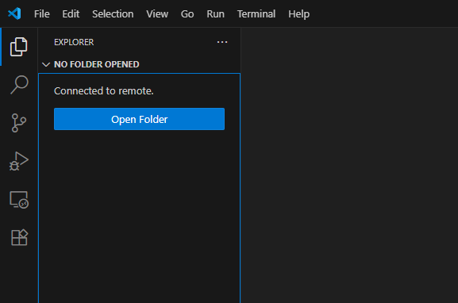


### Второй способ генерации и копирования SSH ключей