# Установка Python и запуск веб-сервера Flask
1. [Установка и настройка Python](#установка-и-настройка-python)
	1. [Сборка Python из исходников](#сборка-python-из-исходников)
	2. [Запуск простого веб-приложения](#запуск-простого-веб-приложения)

---

##### Цель работы:
>Получить навыки по установке и сборке из исходного кода пакетов в Linux, запуску веб-приложений Flask

---

## Установка и настройка Python
### Сборка Python из исходников
Python может быть включен в состав установленного дистрибутива linux. Проверить это можно, например командой:

```bash
python3 --version
```

или

```bash
python3 -V
```


Как мы видим, у нас уже установлен Python версии 3.12.9. Однако на момент написания, последняя стабильная версия - 3.13.7, посмотреть актуальный релиз можно в [официальном репозитории](https://github.com/python/cpython/tags):


Обновить python можно несколькими способами: скачать новый пакет из репозитория или собрать самостоятельно из исходников. В целях расширения кругозора выберем второй способ.

Прежде чем собирать пакет из исходников, установим некоторое вспомогательное ПО с помощью команды:

```bash
sudo dnf install gcc make zlib-devel bzip2-devel openssl-devel xz-devel libffi-devel ncurses-devel sqlite-devel libuuid-devel git -y
```


Исходный код можно получить одним из способов:
- или клонировать репозиторий и переключиться на стабильную ветку (ключ -b позволяет указать клонируемую ветку (branch)):

```bash
git clone -b v3.13.7 https://github.com/python/cpython.git
```


После клонирования должна появиться директория `cpython`, проверить это можно введя в консоль:

```bash
ls
```


- или скачать архив с исходным кодом и распаковать его:

```bash
curl -O https://www.python.org/ftp/python/3.13.7/Python-3.13.7.tgz
```

```bash
tar zxf Python-3.13.7.tgz
```

В данном случае, если посмотреть содержимое домашней директории, можно увидеть архив `Python-3.13.7.tgz` и его распакованную версию.


В нашем случае отдадим приоритет **клонированию репозитория**.

Для дальнейших действий нам нужно перейди в директорию `cpython`:

```bash
cd cpython
```


Теперь, находясь в папке с исходниками, мы можем сконфигурировать сборку Python и выполнить ее. Конфигурация выполняется командой:

```bash
./configure --enable-optimizations
```


После завершения конфигурации собрать Python можно командой:

```bash
make -s -j2
```


Возникшие в процессе сборки оповещения являются следствием опции enable-optimizations. Сборка Python завершена, в текущей директории находится исполняемый файл. Проверим это:

```bash
ls -ahl python
```

```bash
./python -V
```


Следующим этапом будет установка Python, для этого понадобится выполнить команду с правами суперпользователя:

```bash
sudo make -s -j2 install
```

После установки получим следующий результат:


Так происходит, потому что python3.12, поставляемый с дистрибутивом операционной системы, установлен в каталог `/usr/bin`, а собранный нами python3.13 - в `/usr/local/bin`, то есть не произошло перезаписи одной версии на другую. Проверить, так ли это можно при помощи команды:

```bash
which python3
```


Свежая версия уже доступна по алиасу python3, потому что изменена символьная ссылка `/usr/bin/python3`, которая ведет к исполняемому файлу python3.13. Проверить, это можно введя:

```bash
ls -ahl /usr/local/bin/python3
```


Для установки пакетов python используется пакетный менеджер pip. Он был установлен вместе с новой версией Python и его исполняемый файл - `/usr/local/bin/pip3.13`. Однако его удобнее вызывать как pip3.


В дальнейшем для установки необходимых пакетов достаточно воспользоваться командой:

```bash
pip3 install package_name
```

### Запуск простого веб-приложения
>[!NOTE]
>При разработке хорошим тоном считается создавать виртуальное окружение, в которое уже загружать необходимые пакеты. Это легко контролируется, не вредит нашей операционной системе и уберегает от конфликтов версий. 

Создадим виртуальное окружение, но перед этим вернёмся в домашнюю директорию:

```bash
cd
```

Теперь приступим к созданию:

```bash
mkdir -p flask_project
```

```bash
cd flask_project
```

```bash
python3 -m venv venv
```

Мы создали виртуальное окружение в директории `flask_project`, теперь активируем его:

```bash
source venv/bin/activate
```


После выполнения команд можно заметить появившуюся директорию `venv` в папке `flask_project`. Также после активации изменилось приглашение к вводу командной строки, указывающее, что виртуальное окружение активировано.


В директории `venv/bin` находятся символьные ссылки и исполняемые файлы python и pip той версии, которые были использованы при создании виртуального окружения. Другими словами, в виртуальном окружении python и pip можно вызывать без указания версии в названии программы.

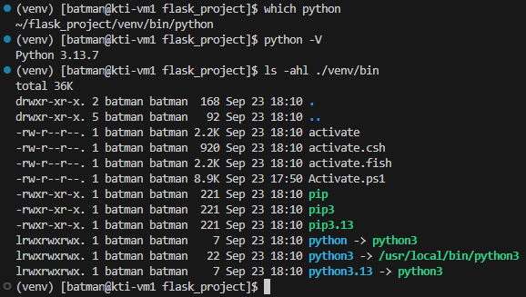

Пакеты можно устанавливать из репозитория [PyPI](https://pypi.org/) или указывая ссылку для загрузки. Установить Flask можно командой:

```bash
pip install flask
```

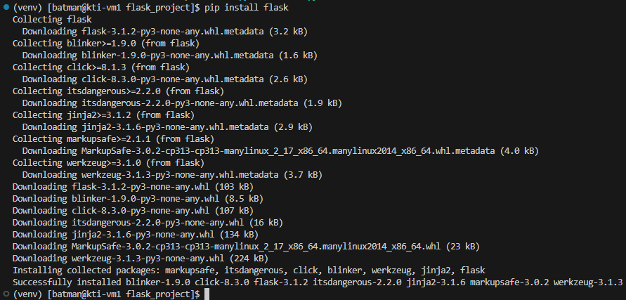

Для проверки работоспособности Flask сделаем простейшее приложение. Создадим в папке `flask_project` директорию `flask_app`, в ней файл `app.py` следующего содержания:

```python
from flask import Flask


app = Flask(__name__)


@app.route("/")
def hello_world():
    return "<p>Hello, World!</p>"
```


*Не забудьте* сохранить изменения в файле с помощью хоткея `ctrl+s`.

Так же для работы с Python в VS Code рекомендуется установить соответствующее расширение (если вдруг пропустили, об этом написано [здесь](Preparation_for_labs.md/#установка-vs-code-и-расширений)).


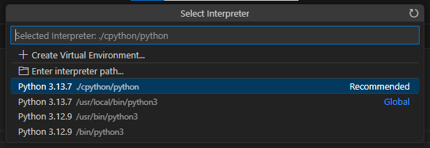


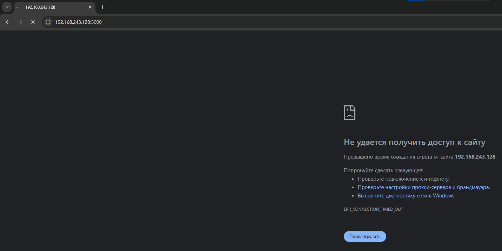


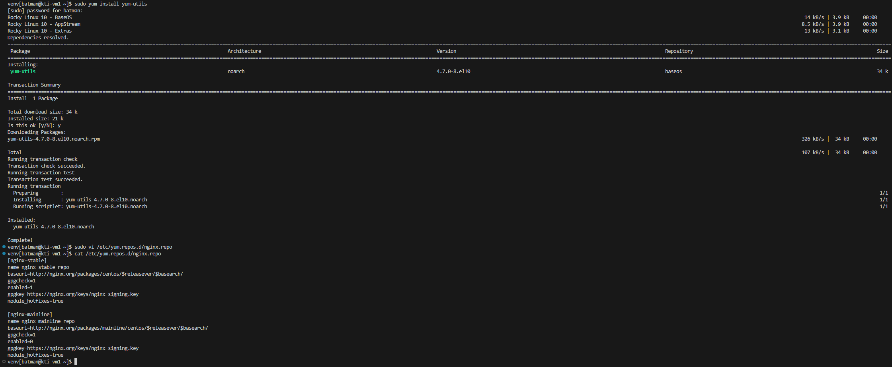

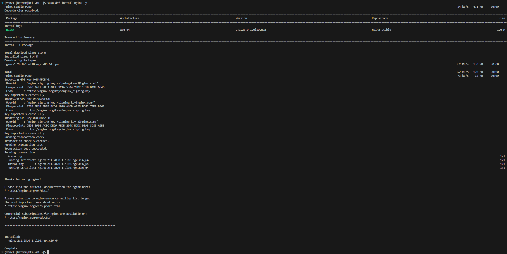


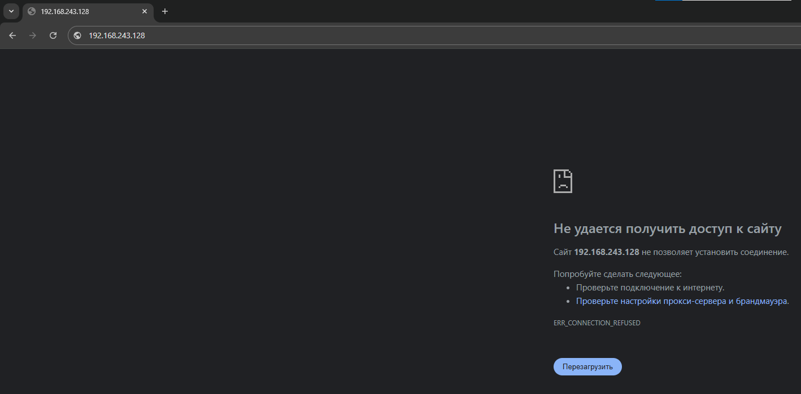

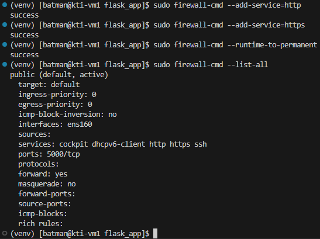


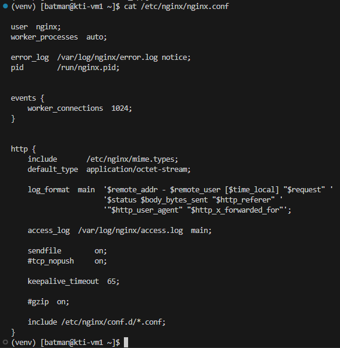


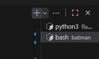


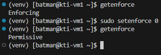

`2025/09/24 23:18:04 [crit] 9286#9286: *9 connect() to 127.0.0.1:5000 failed (13: Permission denied) while connecting to upstream, client: 192.168.243.1, server: _, request: "GET / HTTP/1.1", upstream: "http://127.0.0.1:5000/", host: "192.168.243.128"`


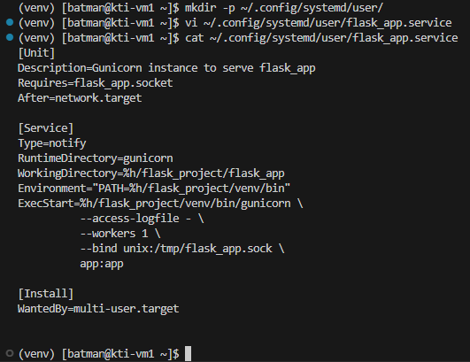


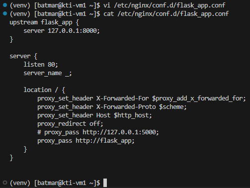


