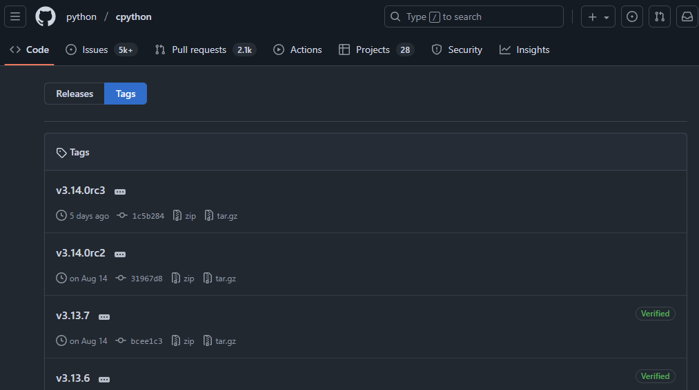
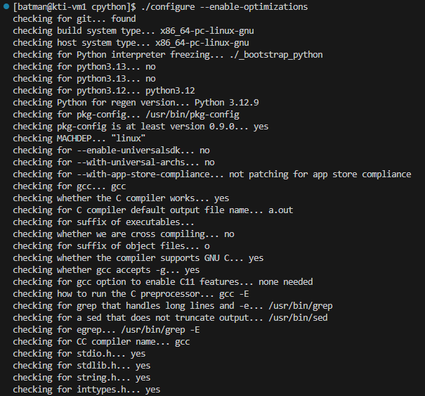
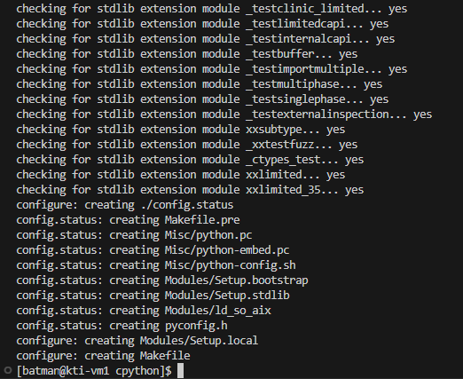
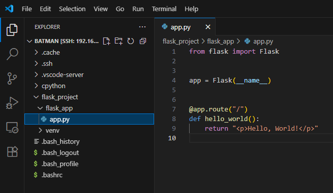

# Установка Python и запуск веб-сервера Flask
1. [Установка и настройка Python](#установка-и-настройка-python)
	1. [Сборка Python из исходников](#сборка-python-из-исходников)
	2. [Запуск простого веб-приложения](#запуск-простого-веб-приложения)

---

##### Цель работы:
>Получить навыки по установке и сборке из исходного кода пакетов в Linux, запуску веб-приложений Flask

---

## Установка и настройка Python
### Сборка Python из исходников
Python может быть включен в состав установленного дистрибутива linux. Проверить это можно, например командой:

```bash
python3 --version
```

или

```bash
python3 -V
```


Как мы видим, у нас уже установлен Python версии 3.12.9. Однако на момент написания, последняя стабильная версия - 3.13.7, посмотреть актуальный релиз можно в [официальном репозитории](https://github.com/python/cpython/tags):



Обновить python можно несколькими способами: скачать новый пакет из репозитория или собрать самостоятельно из исходников. В целях расширения кругозора выберем второй способ.

Прежде чем собирать пакет из исходников, установим некоторое вспомогательное ПО с помощью команды:

```bash
sudo dnf install gcc make zlib-devel bzip2-devel openssl-devel xz-devel libffi-devel ncurses-devel sqlite-devel libuuid-devel git -y
```


Исходный код можно получить одним из способов:
- или клонировать репозиторий и переключиться на стабильную ветку (ключ -b позволяет указать клонируемую ветку (branch)):

```bash
git clone -b v3.13.7 https://github.com/python/cpython.git
```


После клонирования должна появиться директория `cpython`, проверить это можно введя в консоль:

```bash
ls
```


- или скачать архив с исходным кодом и распаковать его:

```bash
curl -O https://www.python.org/ftp/python/3.13.7/Python-3.13.7.tgz
```

```bash
tar zxf Python-3.13.7.tgz
```

В данном случае, если посмотреть содержимое домашней директории, можно увидеть архив `Python-3.13.7.tgz` и его распакованную версию.


В нашем случае отдадим приоритет **клонированию репозитория**.

Для дальнейших действий нам нужно перейди в директорию `cpython`:

```bash
cd cpython
```







### Запуск простого веб-приложения


