# Установка Python и запуск веб-сервера Flask
1. [Установка и настройка Python](#установка-и-настройка-python)
	1. [Сборка Python из исходников](#сборка-python-из-исходников)
	2. [Запуск простого веб-приложения](#запуск-простого-веб-приложения)
2. [Установка веб-сервера NGINX](#установка-веб-сервера-nginx)
3. [Управление конфигурацией веб-сервера NGINX](#управление-конфигурацией-веб-сервера-nginx)
4. [Установка и запуск WSGI-сервера](#установка-и-запуск-wsgi-сервера)
5. [Использование СУБД для хранения информации](#использование-субд-для-хранения-информации)

---

##### Цель работы:
>Получить навыки по установке и сборке из исходного кода пакетов в Linux, запуску веб-приложений Flask

---

## Установка и настройка Python
### Сборка Python из исходников
Python может быть включен в состав установленного дистрибутива linux. Проверить это можно, например командой:

```bash
python3 --version
```

или

```bash
python3 -V
```


Как мы видим, у нас уже установлен Python версии 3.12.9. Однако на момент написания, последняя стабильная версия - 3.13.7, посмотреть актуальный релиз можно в [официальном репозитории](https://github.com/python/cpython/tags):


Обновить python можно несколькими способами: скачать новый пакет из репозитория или собрать самостоятельно из исходников. В целях расширения кругозора выберем второй способ.

Прежде чем собирать пакет из исходников, установим некоторое вспомогательное ПО с помощью команды:

```bash
sudo dnf install gcc make zlib-devel bzip2-devel openssl-devel xz-devel libffi-devel ncurses-devel sqlite-devel libuuid-devel git -y
```


Исходный код можно получить одним из способов:
- или клонировать репозиторий и переключиться на стабильную ветку (ключ `-b` позволяет указать клонируемую ветку (branch)):

```bash
git clone -b v3.13.7 https://github.com/python/cpython.git
```

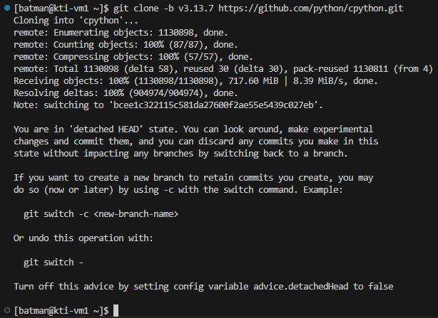

После клонирования должна появиться директория `cpython`, проверить это можно введя в консоль:

```bash
ls
```


- или скачать архив с исходным кодом и распаковать его:

```bash
curl -O https://www.python.org/ftp/python/3.13.7/Python-3.13.7.tgz
```

```bash
tar zxf Python-3.13.7.tgz
```

В данном случае, если посмотреть содержимое домашней директории, можно увидеть архив `Python-3.13.7.tgz` и его распакованную версию.


В нашем случае отдадим приоритет **клонированию репозитория**.

Для дальнейших действий нам нужно перейди в директорию `cpython`:

```bash
cd cpython
```


Теперь, находясь в папке с исходниками, мы можем сконфигурировать сборку Python и выполнить ее. Конфигурация выполняется командой:

```bash
./configure --enable-optimizations
```


После завершения конфигурации собрать Python можно командой:

```bash
make -s -j2
```


Возникшие в процессе сборки оповещения являются следствием опции enable-optimizations. Сборка Python завершена, в текущей директории находится исполняемый файл. Проверим это:

```bash
ls -ahl python
```

```bash
./python -V
```


Следующим этапом будет установка Python, для этого понадобится выполнить команду с правами суперпользователя:

```bash
sudo make -s -j2 install
```

После установки получим следующий результат:


Так происходит, потому что python3.12, поставляемый с дистрибутивом операционной системы, установлен в каталог `/usr/bin`, а собранный нами python3.13 - в `/usr/local/bin`, то есть не произошло перезаписи одной версии на другую. Проверить, так ли это можно при помощи команды:

```bash
which python3
```


Свежая версия уже доступна по алиасу python3, потому что изменена символьная ссылка `/usr/bin/python3`, которая ведет к исполняемому файлу python3.13. Проверить, это можно введя:

```bash
ls -ahl /usr/local/bin/python3
```


Для установки пакетов python используется пакетный менеджер pip. Он был установлен вместе с новой версией Python и его исполняемый файл - `/usr/local/bin/pip3.13`. Однако его удобнее вызывать как pip3.


В дальнейшем для установки необходимых пакетов достаточно воспользоваться командой:

```bash
pip3 install package_name
```

### Запуск простого веб-приложения
>[!NOTE]
>При разработке хорошим тоном считается создавать виртуальное окружение, в которое уже загружать необходимые пакеты. Это легко контролируется, не вредит нашей операционной системе и уберегает от конфликтов версий. 

Создадим виртуальное окружение, но перед этим вернёмся в домашнюю директорию:

```bash
cd
```

Теперь приступим к созданию:

```bash
mkdir -p flask_project
```

```bash
cd flask_project
```

```bash
python3 -m venv venv
```

Мы создали виртуальное окружение в директории `flask_project`, теперь активируем его:

```bash
source venv/bin/activate
```


После выполнения команд можно заметить появившуюся директорию `venv` в папке `flask_project`. Также после активации изменилось приглашение к вводу командной строки, указывающее, что виртуальное окружение активировано.


В директории `venv/bin` находятся символьные ссылки и исполняемые файлы python и pip той версии, которые были использованы при создании виртуального окружения. Другими словами, в виртуальном окружении python и pip можно вызывать без указания версии в названии программы.


Пакеты можно устанавливать из репозитория [PyPI](https://pypi.org/) или указывая ссылку для загрузки. Установить Flask можно командой:

```bash
pip install flask
```


Для проверки работоспособности Flask сделаем простейшее приложение. Создадим в папке `flask_project` директорию `flask_app`, в ней файл `app.py` следующего содержания:

```python
from flask import Flask


app = Flask(__name__)


@app.route("/")
def hello_world():
    return "<p>Hello, World!</p>"
```


>[!NOTE]
>Разберем написанный код. На первой строке из модуля flask импортируется класс Flask, экземпляром которого будет наше приложение. Далее объявляется экземпляр этого класса с аргументом `__name__`. Затем используется декоратор route, сообщающий flask, какой URL должен обрабатываться следующей за ним функцией. Функция в свою очередь возвращает HTML, который будет отображен в браузере.

*Не забудьте* сохранить изменения в файле с помощью хоткея `Ctrl+s`.

Так же для работы с Python в VS Code рекомендуется установить соответствующее расширение (об этом написано [здесь](Preparation_for_labs.md/#установка-vs-code-и-расширений)).


После установки расширения можно выбрать интерпретатор. В случае, если интерпретатор был выбран автоматически, возникнет предупреждение о том, что невозможен импорт из модуля flask.

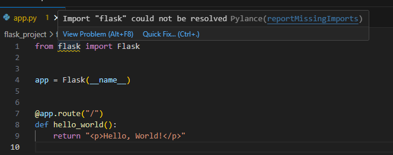

Это связано с тем, что установленное расширение по умолчанию использует системный интерпретатор и ничего не знает о настроенном нами виртуальном окружении. Посмотреть на используемый интерпретатор можно нажав на версию Python в правом нижнем углу.


Следует указать расширению путь к интерпретатору используемому нами в виртуальном окружении.  Его можно узнать из вывода команды:

```bash
which python
```


Теперь запустим наше приложение. Находясь в папке `flask run` пропишем:

```bash
flask run
```


Сообщение `Running on http://127.0.0.1:5000` говорит о том, что приложение запущено и доступно по порту 5000. VS Code заботливо пробросит порт в сетевое окружение хоста, так что URL доступен в браузере:


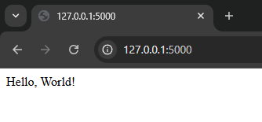

По умолчанию flask запускается и прослушивает только адрес локального сетевого адаптера (localhost). Чтобы получать запрос с других адаптеров, необходимо передать адрес этого сетевого интерфейса при запуске или разрешить принимать подключение со всех сетевых адаптеров. За такое поведение отвечает опция `--host`:

```bash
flask run --host=0.0.0.0
```


В отличие от прошлого запуска в выводе добавилась строка `Running on http://192.168.126.128:5000`. Однако, если попытаться открыть этот URL, увидим ошибку:


Несмотря на то, что порт прослушивается и приложение ожидает подключение по IP-адресу интерфейса виртуальной машины, клиентские запросы из браузера не могут достичь сервера. Все дело в настройках файрволла. Посмотреть список правил можно командой:

```bash
sudo firewall-cmd --list-all
```

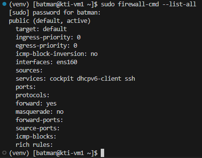

Чтобы исправить ситуацию, необходимо открыть порт 5000 в настройках файрволла:

```bash
sudo firewall-cmd --add-port=5000/tcp
```

Вторая команда нужна для сохранения введенных настроек.

```bash
sudo firewall-cmd --runtime-to-permanent
```


После чего мы видим нужный результат!

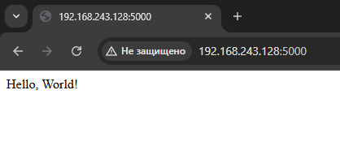

Этого достаточно для локальной разработки, однако в промышленных контурах пользовательские запросы не приходят сразу на сервер приложений, перед этим они проходят через серверы балансировки и распределения нагрузки.

---

## Установка веб-сервера NGINX
>[!NOTE]
>В данной работе веб-сервер NGINX будет использован как обратный прокси-сервер, принимающий запросы пользователя и перенаправляющий их на бэкенд - Flask-приложение.

>[!NOTE]
>Как и подавляющее большинство программного обеспечения, установить веб-сервер nginx на centos можно из репозитория. Для этого можно воспользоваться репозиторием с диска, стандартным преднастроенным репозиторием или добавить репозиторий от разработчика.

Воспользуемся третьим вариантом с целью получить последнюю версию ПО. Прежде всего следует обратиться на сайт разработчика ([рабочая ссылка](https://nginx.org/ru/linux_packages.html#RHEL) на момент написания данного руководства). Воспользуемся предложенным вариантом установки. Создадим новый файл репозитория с помощью **ЛУЧШЕГО** текстового редактора **vi** командой:

```bash
sudo vi /etc/yum.repos.d/nginx.repo
```

Текст можно набрать вручную или скопировать со страницы сайта. В любом случае, прежде чем добавлять контент, необходимо перейти в режим редактирования, нажав `i` (после этого режим поменяется на INSERT, о чем говорит появившаяся снизу надпись).

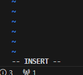

Чтобы сохранить файл можно нажать комбинацию клавиш `Shift+ZZ` или клавишу `Esc`, после чего написать `:wq`.

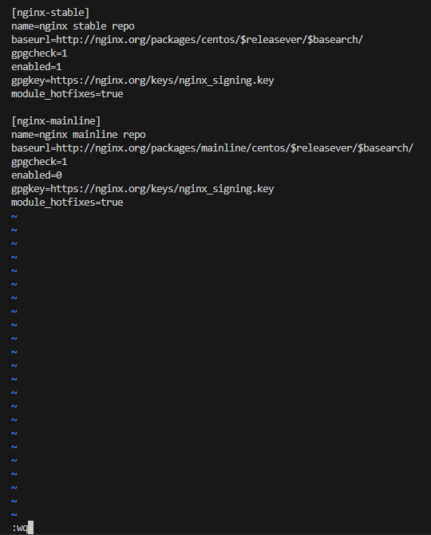

Проверим, сохранились ли изменения в файле:

```bash
cat /etc/yum.repos.d/nginx.repo
```


Теперь, после проверки содержимого файла посмотрим, какую версию и из какого репозитория будет устанавливать пакетный менеджер.

```bash
dnf info nginx
```


```stl
solid cube_corner
  facet normal 0.0 -1.0 0.0
    outer loop
      vertex 0.0 0.0 0.0
      vertex 1.0 0.0 0.0
      vertex 0.0 0.0 1.0
    endloop
  endfacet
  facet normal 0.0 0.0 -1.0
    outer loop
      vertex 0.0 0.0 0.0
      vertex 0.0 1.0 0.0
      vertex 1.0 0.0 0.0
    endloop
  endfacet
  facet normal -1.0 0.0 0.0
    outer loop
      vertex 0.0 0.0 0.0
      vertex 0.0 0.0 1.0
      vertex 0.0 1.0 0.0
    endloop
  endfacet
  facet normal 0.577 0.577 0.577
    outer loop
      vertex 1.0 0.0 0.0
      vertex 0.0 1.0 0.0
      vertex 0.0 0.0 1.0
    endloop
  endfacet
endsolid
```


---

## Управление конфигурацией веб-сервера NGINX


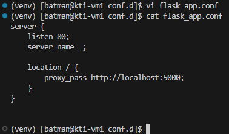


`2025/09/24 23:18:04 [crit] 9286#9286: *9 connect() to 127.0.0.1:5000 failed (13: Permission denied) while connecting to upstream, client: 192.168.243.1, server: _, request: "GET / HTTP/1.1", upstream: "http://127.0.0.1:5000/", host: "192.168.243.128"`


---

## Установка и запуск WSGI-сервера


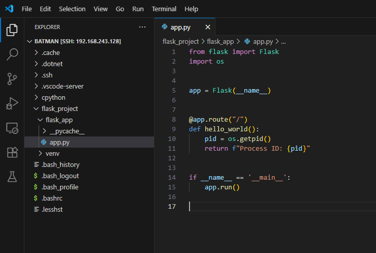


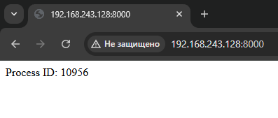


---

## Использование СУБД для хранения информации


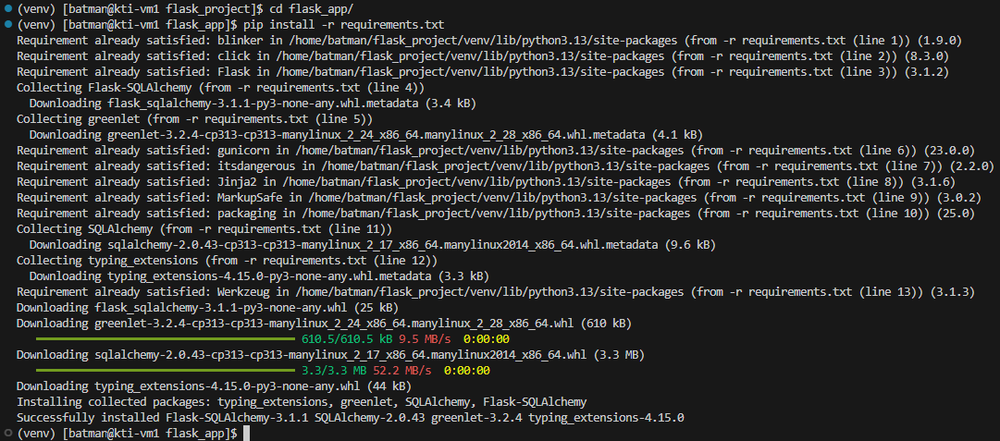


